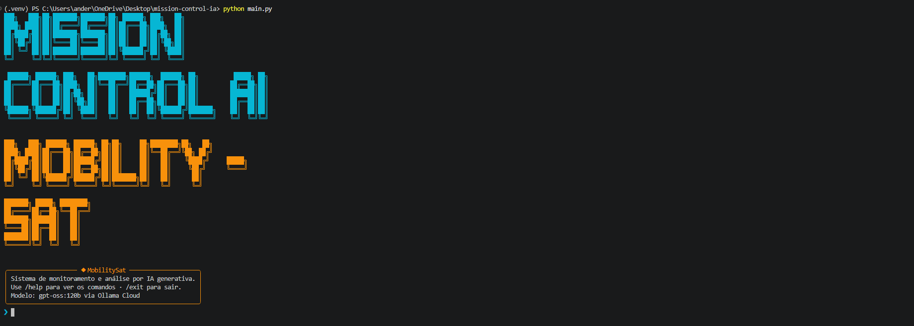
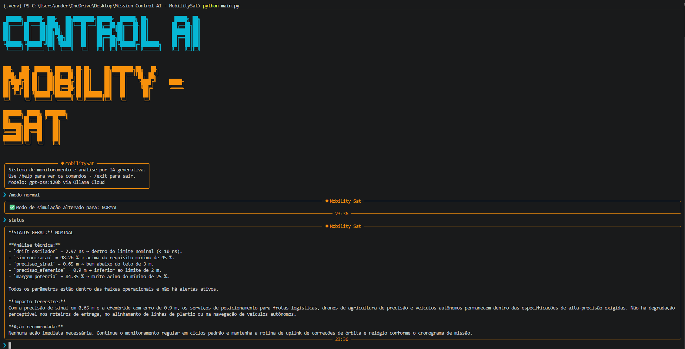
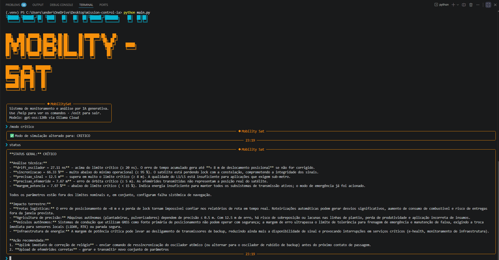
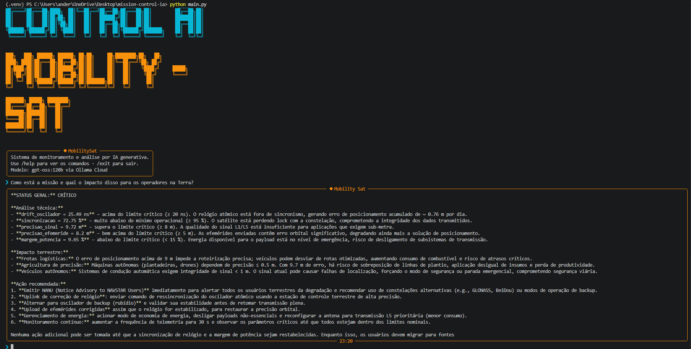

# Mission Control AI - MobilitySat

## 👨‍🚀 Integrantes
- Christian Raymundo Diaz - RM 568324 - 1CCPB
- Hanin Atwi              - RM 567626 - 1CCPB
- Giulia Martins Ferrari  - RM 567574 - 1CCPB 
---

## 🛰️ Sobre o Projeto - O que o projeto faz
1. O Mission Control AI é um sistema autônomo de monitoramento telemétrico para a missão GNSS MobilitySat. 
2. Ele integra scripts Python de avaliação de thresholds matemáticos a um modelo de Inteligência Artificial generativa (Ollama Cloud `gpt-oss:120b`). 
3. A IA atua não como tomadora de decisão, mas como uma engenheira sênior (ARIA) que traduz falhas orbitais técnicas (como um *drift* de oscilador atômico) em impactos terrestres concretos, facilitando a tomada de decisão para operadores em solo.

## 👤 Persona Atendida
O sistema foi desenhado para **Engenheiros de Segmento Espacial e Operadores de Centro de Controle**. 
O objetivo é poupar a carga cognitiva destes profissionais durante anomalias e gerar relatórios imediatos sobre como a degradação do satélite afeta diretamente seus clientes finais (operadores de frotas e agricultores).

---

## 💼 Proposta de Valor e Modelo de Negócio

1. **Qual o problema real terrestre que esta missão resolve?**
A degradação não alertada do sinal GNSS causa prejuízos milionários em frotas logísticas mal roteirizadas e provoca falhas severas na agricultura de precisão (como a sobreposição de linhas por plantadeiras autônomas). O sistema previne esse dano financeiro e operacional com alertas em tempo real e tradução do impacto.

2. **Quem paga pela solução?**
Modelo híbrido. O setor privado (grandes cooperativas do agronegócio, operadoras portuárias e transportadoras) paga por acesso prioritário à telemetria premium e alertas de degradação antecipados. O governo (ou operadora oficial) financia a manutenção da infraestrutura base.

3. **Métrica de impacto:**
Se o MobilitySat operar de forma 100% nominal por um ano, ele garante a otimização de rota e segurança de mais de 5.000 frotas logísticas pesadas e evita o desperdício de insumos químicos (adubo/defensivos) em mais de 10.000 hectares de agricultura totalmente automatizada no país.

4. **Modelo de negócio:**
Operamos em um modelo de **Dado-como-serviço (DaaS) via Assinatura (SaaS)**. Clientes corporativos assinam diferentes *tiers* (níveis) de serviço, garantindo acesso via API a relatórios de predição de degradação de sinal, enquanto o nível básico de monitoramento é mantido como concessão pública.

---

## 🛠️ Tecnologias Utilizadas
- **Linguagem:** Python 3.10+
- **IA Generativa:** Ollama Cloud API (modelo `gpt-oss:120b`)
- **Bibliotecas Principais:** `ollama`, `python-dotenv`, `prompt-toolkit`, `rich`, `pyfiglet`

---

## 🚀 Como Executar

1. Clone este repositório para a sua máquina local:
   `git clone https://github.com/seu-usuario/mission-control-ai.git`

2. Acesse a pasta do projeto e crie o ambiente virtual:
   `python -m venv venv`

3. Ative o ambiente virtual:
   - Windows: `venv\Scripts\activate`
   - Mac/Linux: `source venv/bin/activate`

4. Instale as dependências com as versões fixadas:
   `pip install -r requirements.txt`

5. Configure suas credenciais:
   - Copie o arquivo `.env.example` e renomeie para `.env`.
   - Adicione a sua chave da Ollama Cloud: `OLLAMA_API_KEY=sua_chave_aqui_sem_aspas`
   
6. Execute a aplicação:
   `python main.py`

---

## 📸 Demonstração Visual

[Modo degradado da missão](assets/print_modo_degradado.png )

---

## 🎬 Vídeo de Demonstração
**[Assistir demonstração completa no YouTube]([https://youtu.be/--jc93-LMNk)**
> *Privacidade configurada como "Não listado".*

---

## 🧪 Cenários de Teste Demonstrados
O sistema foi testado simulando três estados críticos através da funcionalidade especial da CLI:
1. **Comando `/modo normal`:** Operação padrão, precisão de sinal dentro de 3 metros, energia adequada. IA relata impactos positivos.
2. **Comando `/modo degradado`:** Leve drift no relógio atômico, reduzindo a sincronização. IA alerta o setor agrícola sobre o risco inicial na plantagem de precisão.
3. **Comando `/modo critico`:** Simulada falha severa na efeméride e perda crítica de L1/L5. O código aciona o oscilador de backup autônomo, e a IA alerta para o perigo iminente em veículos terrestres e perda de sinal.

---

## 🧠 System Prompt e IA
O *prompt* de sistema estruturado orienta o LLM a atuar estritamente como ARIA, aplicando *few-shot prompting* para garantir que a IA não sofra *hallucination* (por isso rodamos o motor com `temperature=0.3`). O prompt integral pode ser validado no arquivo `prompts/system_prompt.md`.

## 🚧 Limitações Conhecidas
- **Ausência de Integração de Hardware Real:** O sistema opera com dados telemétricos simulados matematicamente no código. Não consome rádio-frequência real (RF).
- **Janela de Contexto Histórico Limitada:** Para evitar extrapolação de limite de tokens da API, a "memória temporal" do LLM restringe-se às últimas 5 leituras do *snapshot*.
